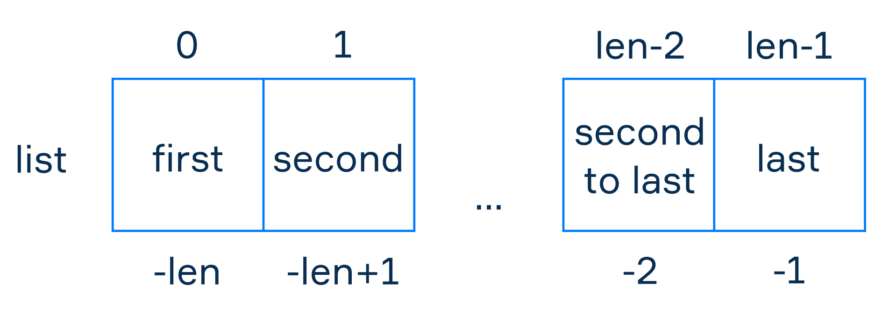

# Theory: Indexes

There are several types of collections to store data in Python. Positionally ordered collections of elements are usually called **sequences**, and both lists and strings belong to them. Each element in a list, as well as each character in a string, has an **index** that corresponds to its position. Indexes are used to access elements within a sequence. Indexing is ***zero-based***, so if you see a person who counts from zero, you must have met a programmer.

## Table of contents

[↑ Indexes](#Theory:-Indexes)

1. [Indexes of elements](##Indexes-of-elements)
2. [Potential pitfalls](##Potential-pitfalls)
3. [Negative indexes](##Negative-indexes)

## Indexes of elements

To access an element of a list by its index, you need to use **square brackets**. You add the brackets after the list and, between them, you write the index of an element you want to get.

Don't forget, the indexes start at 0, so the index of the first element is 0. The index of the last element is equal to `len(list) - 1`.

Let's take a look at the example below:

```
colors = ['red', 'green', 'blue']

first_elem = colors[0]   # 'red'
second_elem = colors[1]  # 'green'
third_elem = colors[2]   # 'blue'
```

Strings work in the same way:

```
pet = "cat"

first_char = pet[0]   # 'c'
second_char = pet[1]  # 'a'
third_char = pet[2]   # 't'
```

## Potential pitfalls

When using indexes, it's important to stay within the range of your sequence: you'll get an error (called `IndexError`) if you try to access an element with a non-existing index!

```
colors = ['red', 'green', 'blue']
pet = "cat"

print(colors[3])  # IndexError: list index out of range
print(pet[3])     # IndexError: string index out of range
```

There is one more obstacle in your way. Imagine that you want to change one of the elements in a list. It can be easily done:

```
colors = ['red', 'green', 'blue']

colors[1] = 'white'
print(colors)  # ['red', 'white', 'blue']
```

However, when it comes to strings, such reassignment is impossible. Strings, unlike lists, are immutable, so you can't modify their contents with indexes:

```
pet = "cat"

pet[0] = "b"
# TypeError: 'str' object does not support item assignment
```

Don't worry, after some practice, you will not encounter these errors.

## Negative indexes

The easier way to access the elements at the end of a list or a string is to use **negative indexes**: the minus before the number changes your perspective in a way and you look at the sequence from the end. So, the last element of a list, in this case, has the index equal to **-1**, and the first element of the list has the index `-len(list)` (the length of the list).

For example:

```
colors = ['red', 'green', 'blue']

last_elem = colors[-1]    # 'blue'
second_elem = colors[-2]  # 'green'
first_elem = colors[-3]   # 'red'

pet = "cat"

last_char = pet[-1]    # 't'
second_char = pet[-2]  # 'a'
first_char = pet[-3]   # 'c'
```

As you can see, it works the same for lists and strings.

If you write a non-existing negative index, you'll also get `IndexError`. Be careful with indexes to avoid off-by-one errors in your code.

The following picture shows the general concept of indexes in a list:



Since you have learned the concept of indexes, we hope that from now on you will not encounter any difficulties when using them!