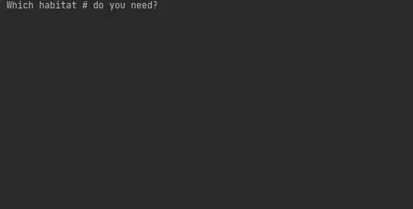

# Project: Zookeeper

## About

This prokect can help the local zoo look after its denizens. It is a tool for monitoring animals and their status.

## Learning Outcomes

This is a beginner project. It helps with understanding some basic syntax and how to work with variables, data storage types such as lists, and while loops.

## What is done and what is learnt

### Stage 1/4: Rush into print.
First, we get some simple output from the code.

- Introduction to Python
- Overview of the basic program
- Multi-line programs

### Stage 2/4: Show me an animal!
Show the zookeeper and image of her ward.
- PEP 8
- Comments
- Basic data types
- Quotes and multi-line strings

### Stage 3/4: What's inside? 
The zookeeper wants to know what is inside each habitat, by its number.
- Variables
- List
- Taking input
- Indexes

### Stage 4/4: Sustainable care <3
Finally, the program is able to work for as long as needed!
- Integer arithmetic
- Naming variables
- Program with numbers
- Boolean logic
- Comparisons
- If statement
- While loop
